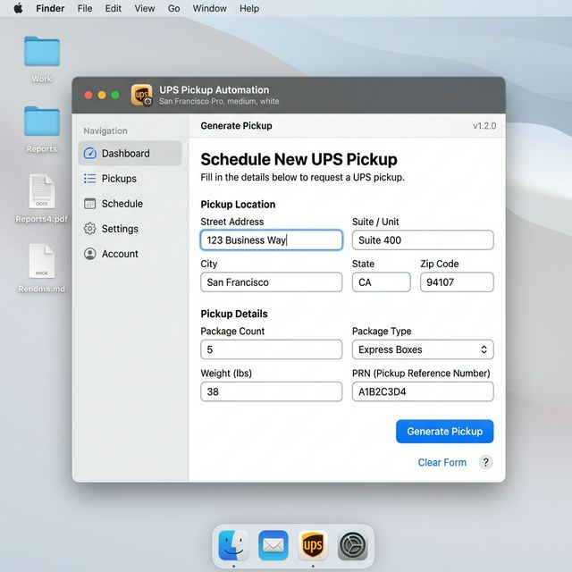

# 🚀 UPS Pickup Automation Engine

**Bridging User Experience and Logistics Efficiency with Intelligent Automation**



[](https://www.python.org/downloads/)
[](https://www.ups.com/upsdeveloperkit)
[]()
[](https://opensource.org/licenses/MIT)

## 🌟 Overview
The **UPS Pickup Automation Engine** is a professional-grade desktop utility that streamlines high-volume logistics operations. It transforms the manual, error-prone process of scheduling UPS pickups into a seamless, automated workflow using **NLP-driven address parsing**, **real-time API integration**, and a **modern macOS-inspired interface**.

---

## 💎 Features that Matter

### 🎨 macOS-Inspired UI/UX
Designed with a "minimal yet powerful" philosophy. The interface features:
- **San Francisco Typography**: Native-feel readability.
- **Card-Based Layouts**: Organized, high-contrast forms to reduce operator fatigue.
- **Accent Actions**: High-contrast blue buttons for primary logistical operations.
- **Live Status Monitor**: Real-time feedback via a persistent, minimal status bar.

### 🧠 Intelligent Address Normalization
Logistics data is often messy. This engine features:
- **Heuristic NLP Parsing**: Automatically extracts Company/Contact info from unstructured text.
- **Auto-Normalization**: Converts full state/province names (e.g., "Quebec") to ISO codes ("QC") to ensure 100% API compatibility.
- **Country-Aware Logic**: Dynamically switches service codes (Standard vs. Ground) based on destination country.

### ⏰ Advanced Business Logic
- **Regional Cutoff Awareness**: Automatically validates requested pickup times against known regional constraints (e.g., 11:00 AM cutoffs in remote border towns).
- **Timezone-Safe Scheduling**: Smartly adjusts "Ready Times" for same-day requests to prevent "past-time" API rejections.
- **Automatic Label Fallback**: Intelligently handles cross-border account restrictions by falling back to verified tracking numbers.

---

## 👨‍💻 Technical Architecture

### **Modular System Design**
The application is built on a clean, decoupled architecture:
- **`UPSApiClient`**: An asynchronous wrapper for the UPS REST API (OAuth2, Pickup, Shipping).
- **`AddressParser`**: A utility layer leveraging the `usaddress` library and regex for robust data extraction.
- **`UPSPickupGUI`**: A responsive Tkinter-based view layer styled with modern `ttk` themes.

### **Tech Stack**
- **Language**: Python 3.10+
- **APIs**: UPS REST API (OAuth2 / JSON)
- **GUI**: Tkinter + Custom `ttk.Style` styling
- **Parsing**: `usaddress`, `regex`
- **Data**: `openpyxl` (Excel), `json` (History)

---

## 🛠️ Performance Highlights
- **Batch Processing**: Schedule up to **150 pickups** in a single execution thread.
- **Response Efficiency**: Maintains UI responsiveness during API calls via Python threading.
- **Audit Ready**: Serialization of every request into a searchable local history with professional-grade Excel exports.

---

## 🚀 Technical Challenges Overcome
*One of the most complex challenges was resolving specific UPS business rule rejections (Code 9510113). By implementing a diagnostic test suite to probe regional API cutoffs, I mapped specific limitations (such as the 11:00 AM cutoff for Rouses Point, NY) and integrated proactive validation logic to guide operators before submission.*

---

## 🛠️ Installation

```bash
# 1. Clone the repo
git clone https://github.com/jacksonzhuang07/UPSBatchPickupGenerator.git

# 2. Install dependencies
pip install -r requirements.txt

# 3. Setup .env with UPS Credentials
# (See .env.template for required fields)

# 4. Launch
python main.py
```

---
*Developed with a commitment to visual excellence and technical precision.*
